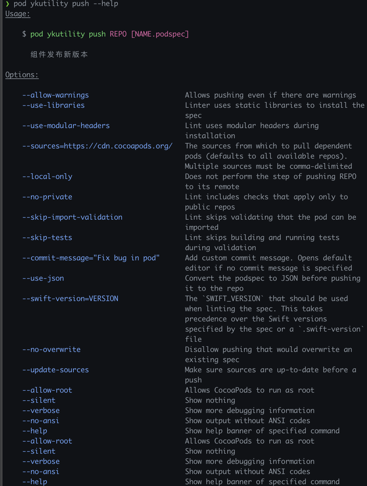
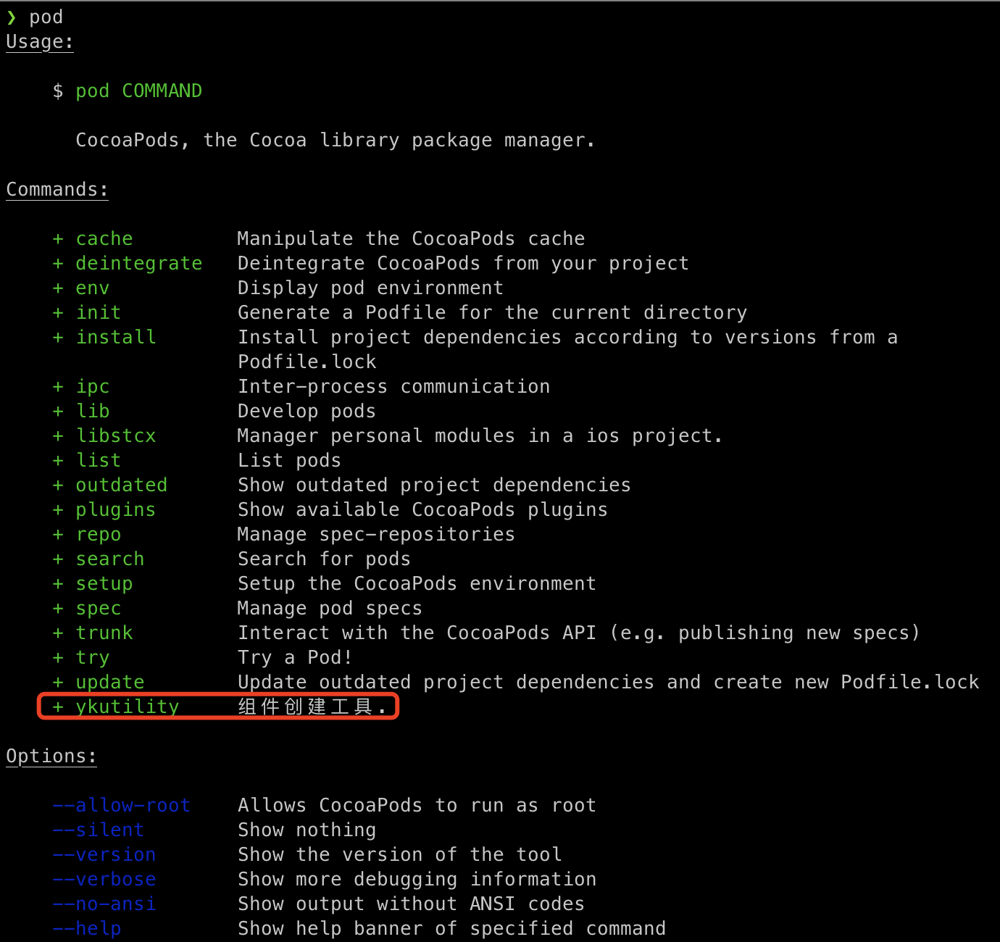
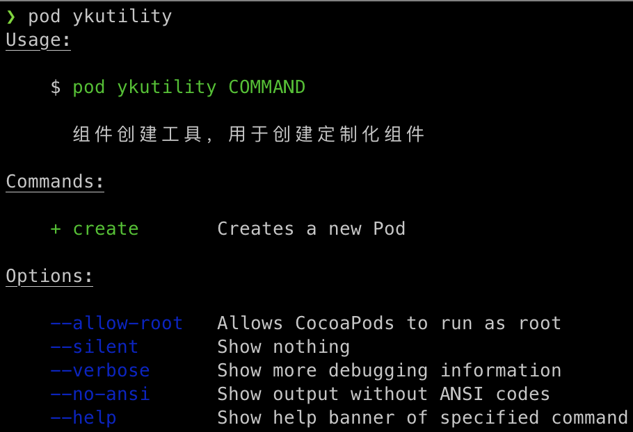
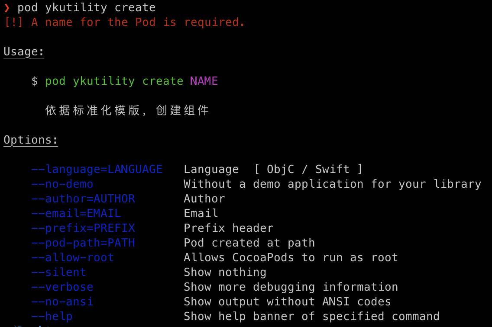

- [cocoapods-ykutility](#cocoapods-ykutility)
    - [Installation](#installation)
    - [使用](#使用)
        - [创建Pod](#创建pod)
            - [快速创建pod](#快速创建pod)
            - [附带参数创建Pod](#附带参数创建pod)
        - [发布pod](#发布pod)
        - [帮助](#帮助)

# cocoapods-ykutility

创建定制化Pod模板.

## Installation

    gem install cocoapods-ykutility

## 使用

### 创建Pod

可使用工具的 create 指令创建定制化pod。

#### 快速创建pod

指令：

  ```shell
  pod ykutility create POD_NAME
  ```

> 快速创建pod，会使用默认参数，参数如下：
>
> - 开发语言： swift
> - 类前缀: YK
> - 作者：使用git的全局配置 'git config --global --list'
> - 附带swift版本的demo

#### 附带参数创建Pod

帮助指令：

```shell
pod ykutility create --help
```

example:

```shell
pod ykutility create YKHTTPClientTest  --language=objc --author=testAuthor --email=testEmail@xxx.com --prefix=YK --pod-path=/Users/xxx/Desktop/WorkDir --no-demo
```

> 参数说明：
>
> - 通过帮助指令，可以查看参数列表
> - 带 '=' 号的参数是 options 类型参数，需要附带数值， 且 '='之间不要有空格， 例： --language=ojbc --prefix=ST --pod-path="
    /Users/imac24inch/Desktop"
> - --no-demo 是flag类型参数， 不需要附带数值

## 通过xcodegen创建pod

可使用工具的 gen 指令创建定制化pod。

gen 指令和create目的一样， 但是使用xcodegen来构建example。

#### 快速创建pod

指令：

  ```shell
  pod ykutility gen POD_NAME
  ```

> 快速创建pod，会使用默认参数，参数如下：
>
> - 开发语言： swift
> - 类前缀: YK
> - 作者：使用git的全局配置 'git config --global --list'
> - 附带swift版本的demo

#### 附带参数创建Pod

帮助指令：

```shell
pod ykutility gen --help
```

example:

```shell
pod ykutility gen YKHTTPClientTest  --language=objc --author=testAuthor --email=testEmail@xxx.com --prefix=YK --pod-path=/Users/xxx/Desktop/WorkDir --no-demo
```

> 参数说明：
>
> - 通过帮助指令，可以查看参数列表
> - 带 '=' 号的参数是 options 类型参数，需要附带数值， 且 '='之间不要有空格， 例： --language=ojbc --prefix=ST --pod-path="
    /Users/imac24inch/Desktop"
> - --no-demo 是flag类型参数， 不需要附带数值

### 发布pod

- 帮助指令：

  ```shell
  pod ykutility push --help
  ```

- 原理：

  组件在官方指令基础上，对push指令做了扩展，原理流程如下：

    - 检查本机git仓库状态
    - 执行官方的pod repo push
    - 分析源码文件
    - 使用 sourcekitten 提取objc,swift文件的注释，生成json中间文档
    - 使用 jazzy 工具，生成一套 html 版本的接口文档， 文档位于 Api 文件夹下
    - 提交Api文件夹，形成提交C0
    - 删除原始tag, 基于提交C0,生成新的tag
    - 推送tag到远端仓库

- 参数列表：
  

### 帮助

不需要专门记忆插件名称，可通过cocoapods的帮助指令查看插件使用方法。

- 查看插件

  ```shell
  pod
  ```

  效果：
  

- 查看插件指令集

  ```shell
  pod ykutility
  ```

  效果：
  

- 查看组件指令使用说明

  ```shell
  pod ykutility create
  ```

  效果：
  
